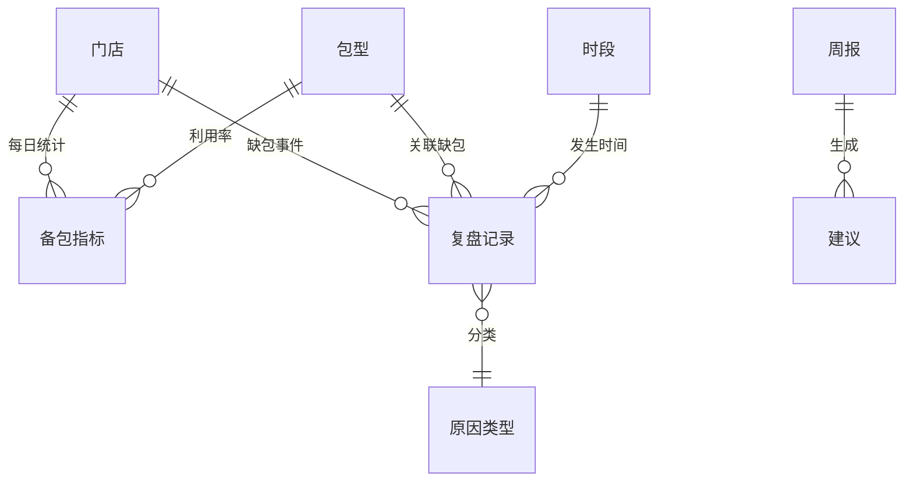

## 1. 架构设计

```mermaid
flowchart TB
    subgraph "前端层"
        "React 18 + Vite" --> "Tailwind CSS"
        "React 18 + Vite" --> "Recharts 图表"
        "React 18 + Vite" --> "React Router"
    end
    subgraph "数据层"
        "Mock Data Store" --> "门店备包数据"
        "Mock Data Store" --> "包型利用率数据"
        "Mock Data Store" --> "复盘记录数据"
    end
    "前端层" --> "数据层"
```

纯前端应用，使用 Mock 数据模拟后端接口，无需后端服务。

## 2. 技术说明

- 前端：React@18 + Tailwind CSS@3 + Vite
- 初始化工具：Vite (react-ts 模板)
- 图表库：Recharts@2
- 路由：React Router@6
- 后端：无（纯前端 Mock 数据）
- 数据库：无（使用内存 Mock 数据 + localStorage 持久化复盘记录）

## 3. 路由定义

| 路由 | 用途 |
|------|------|
| / | 重定向至 /overview |
| /overview | 门店备包总览页 |
| /analysis | 包型利用率分析页 |
| /review | 复盘记录与周报页 |

## 4. API 定义

无后端API，使用前端 Mock 数据模块模拟数据返回。

### 4.1 数据接口定义

```typescript
interface StoreMetrics {
  storeId: string
  storeName: string
  todayAppointments: number
  actualPacks: number
  shortageCount: number
  urgentCount: number
  isNoonPeakShortage: boolean
}

interface PackTypeUtilization {
  packType: string
  utilizationRate: number
  totalPacks: number
  usedPacks: number
  status: 'surplus' | 'normal' | 'tight'
}

interface AnomalyStore {
  storeId: string
  storeName: string
  shortageCount: number
  shortageRate: number
}

interface AnomalyTimeSlot {
  timeSlot: string
  shortageCount: number
}

interface FrequentInstrument {
  instrumentName: string
  shortageCount: number
  relatedPackTypes: string[]
}

interface ReviewRecord {
  id: string
  storeId: string
  storeName: string
  eventTime: string
  packType: string
  reason: '预约变更' | '消毒锅排程' | '器械损坏' | '人员漏备'
  note: string
  createdBy: string
  createdAt: string
}

interface WeeklyReport {
  weekRange: string
  totalShortages: number
  topShortageStores: AnomalyStore[]
  topShortageTimeSlots: AnomalyTimeSlot[]
  topMissingInstruments: FrequentInstrument[]
  suggestions: Suggestion[]
}

interface Suggestion {
  type: '增配包' | '调整备包时间' | '培训新护士'
  target: string
  description: string
}
```

## 5. 服务端架构图

不适用（纯前端项目）

## 6. 数据模型

### 6.1 数据模型定义



### 6.2 数据定义

使用 TypeScript 类型定义 + Mock 数据文件，复盘记录使用 localStorage 持久化存储。Mock 数据涵盖5家门店、6种包型、近7日历史数据。
